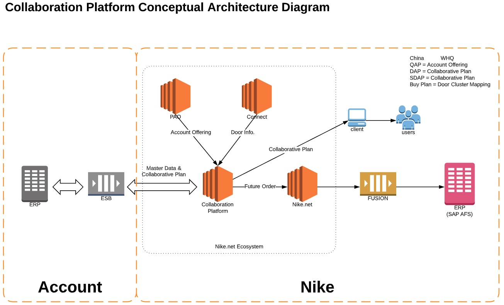

# 微服务架构简介
敏捷开发，微服务架构很多人会聊，但是两者如何更好的有机结合？微服务如何拆分?并且能够满足敏捷开发思想迭代交付？关于这些我想大多数人还是经验主义。很多做法无非是基于自己以往的经验或者别人的经验。
实际上有了DDD，微服务怎么拆分，拆的对不对在你对应DDD的应用以及分析过程当中，自然而然的会得到答案。
在此希望借由这个文章给大家起个头。
这个文章大致梳理了关于微服务架构和DDD的一些知识点，和作为一个架构师你需要知道那些东西以及需要做哪些事情。让大家能够清晰的知道一个PE或者架构师的产出是什么。

## 前言
首先这个文章的一些看法放到别的公司和环境下可能完全不适用，我希望大家都能够记住一点，没有任何一个技术或者架构是银弹。所有的技术和架构的选择以及在构建过程当中的所有选择就应该基于实际情况。不同的企业以及业务均有他们各自不同的着重点因此必然会采用不同的架构体系和技术。

## 什么是DDD？以及为什么需要DDD？
软件开发不是一蹴而就的事情，我们不可能在不了解产品（或行业领域）的前提下进行软件开发，在开发前，通常我们需要进行大量的业务知识梳理，而后达到软件设计的层面，最后才是开发。而在业务知识梳理的过程中，我们必然会形成某个领域知识，根据领域知识来一步步驱动软件设计，就是领域驱动设计的基本概念。
听起来这和传统意义的软件开发没啥区别，只是换了点新鲜的名词而已，其实不然。
一般软件设计或者说软件开发分两种：`瀑布式`，`敏捷式`。两种开发方式就不在此展开了。我们目前最流行也是我们现在采用的就是敏捷开发了。
而DDD则可以说是非常适合敏捷开发和微服务架构的，它以领域模型为粒度。同时又可以提供一个产品或者系统完整的视角。由此我们可以依照DDD的对各个功能模块边界的划分进行微服务的拆分并进行迭代开发。

> 所谓领域模型就是能够精确反映领域中某一知识元素的载体，这种知识的获取需要通过与`领域专家(Domain Expert)`进行频繁的沟通才能将专业知识转化为领域模型。领域模型无关技术，具有高度的业务抽象性，它能够精确的描述领域中的知识体系；同时它也是独立的，我们还需要学会如何让它具有表达性，让模型彼此之间建立关系，形成完整的领域架构。通常我们可以用象形图或一种`通用的语言(Ubiquitous Language)`去描述它们之间的关系。在此之上，我们就可以进行`领域中的代码设计(Domain Code Design)`  

## DDD由什么组成？

### Entity
与面向对象中的概念类似，在这里再次提出是因为它是领域模型的基本元素。在领域模型中，实体应该具有唯一的标识符，从设计的一开始就应该考虑实体，决定是否建立一个实体也是十分重要的。而实体应该封装了该实体所关联的功能模块的业务逻辑。

### Value Object
和编程中数值类型的变量是不同的，它仅仅是没有唯一标识符的实体，比如有两个收获地址的信息完全一样，那它就是值对象，并不是实体。值对象在领域模型中是可以被共享的，他们应该是“不可变的”（只读的），当有其他地方需要用到值对象时，可以将它的副本作为参数传递。

### Service
当我们在分析某一领域时，一直在尝试如何将信息转化为领域模型，但并非所有的点我们都能用Model来涵盖。对象应当有属性，状态和行为，但有时领域中有一些行为是无法映射到具体的对象中的，我们也不能强行将其放入在某一个模型对象中，而将其单独作为一个方法又没有地方，此时就需要服务.
服务是无状态的，对象是有状态的。所谓状态，就是对象的基本属性：高矮胖瘦，年轻漂亮。服务本身也是对象，但它却没有属性（只有行为），因此说是无状态的。
以我的经验，`Service`更多用于表现外部依赖。

### Repository
仓库封装了获取对象的逻辑，领域对象无须和底层数据库交互，它只需要从仓库中获取对象即可。仓库可以存储对象的引用，当一个对象被创建后，它可能会被存储到仓库中，那么下次就可以从仓库取。如果用户请求的数据没在仓库中，则会从数据库里取，这就减少了底层交互的次数。

### Model
对于一个复杂的应用来说，领域模型将会变的越来越大，以至于很难去描述和理解，更别提模型之间的关系了。模块的出现，就是为了组织统一的模型概念来达到减少复杂性的目的的。而另一个原因则是模块可以提高代码质量和可维护性，比如我们常说的高内聚，低耦合就是要提倡将相关的类内聚在一起实现模块化。
模块应当有对外的统一接口供其他模块调用，比如有三个对象在模块a中，那么模块b不应该直接操作这三个对象，而是操作暴露的接口。模块的命名也很有讲究，最好能够深层次反映领域模型。

### Factories
在大型系统中，实体和聚合通常是很复杂的，这就导致了很难去通过构造器来创建对象。工厂就决解了这个问题，它把创建对象的细节封装起来，巧妙的实现了依赖反转。当然对聚合也适用（当建立了聚合根时，其他对象可以自动创建）。工厂最早被大家熟知可能还是在设计模式中，的确，在这里提到的工厂也是这个概念。
但是不要盲目的去应用工厂，以下场景不需要工厂：
a)构造器很简单
b)构造对象时不依赖于其他对象的创建
c)用策略模式就可以解决

### Aggregates
聚合被看作是多个模型单元间的组合，它定义了模型的关系和边界。每个聚合都有一个根，根是一个实体，并且是唯一可被外访问的。正是如此，聚合可以保证多个模型单元的不变性，因为其他模型都参考聚合的根。所以要想改变其他对象，只能通过聚合的根去操作。根如果没有了，那么聚合中的其他对象也将不存在。

## Domain分层

### 领域关系图

### 领域层关系图

#### User Interface Layer
负责向用户展现信息，并且会解析用户行为，即常说的展现层。因为我们现在是单页架构。因此可以理解为一组或者一个单页就是一个`Model`，另一个层面在一些复杂的，多系统协作的环境中。这里也包括其他系统对我们系统的依赖，比如API的调用或者来自外部的数据获取等。

#### Application Layer
在微服务架构中，这一层就是我们对微服务的抽象。比如`Controller`通常一个微服务只包括一个`Controller`是比较合理的。但是实际上经常不是这样，因此我们也可以吧多个耦合度很高的`Controller`合并到一个`Model`中组成一个对外的微服务。这里一个Model我们可以理解它就是一个微服务。他会Aggregate到某个User Interface Layer的一个或者一组页面，但是这里要注意，如果我们这里某个微服务需要从其他地方获取数据，也就是所谓的Aggregate数据到当前微服务。那么他们关系就是反向的。

#### Domain Layer
这一层包含有关领域的信息，是业务的核心，领域模型的状态都直接或间接（持久化至数据库）存储在这一层。这一层主要包括`Entity`,`Repository`和`Factories`,多个有深刻业务关系以及粒度的会组合成Model，多个耦合的`Model`他们会根据业务实际情况进行`Aggregates`。最终这些`Model`会`Aggregate`到`Application Layer`的`Controller`。

#### Infrastructure Layer
为其他层提供底层依赖操作。通常数据库，缓存，文件存储等都在这一层。他们被`Domain Layer`的`Repository`使用

## 微服务架构
微服务架构是一种分布式由多个微服务协作所组成的架构。
我面试候选人的时候经常会问一个问题，SOA架构和微服务架构有什么区别？
实际上在我看来单纯从组织方式上来说是没有很大区别的，大家都是面向服务。
它们的区别主要表现在
* 微服务架构去中心化
* 微服务架构颗粒度更小
* 微服务架构采用Restful风格HTTP协议的API
那么SOA架构一定比微服务架构落后吗？不是！实际上在大型企业购买了一些行业中比较好的大型软件，乃至SAAS平台时，SOA和微服务架构混合往往更加合理。

### 微服务架构的优缺点
#### 优点
* 首先，通过分解巨大单体式应用为多个服务方法解决了复杂性问题。在功能不变的情况下，应用被分解为多个可管理的服务。每个服务都有一个用RPC或者消息驱动API定义清楚的边界。微服务架构模式给采用单体式编码方式很难实现的功能提供了模块化的解决方案，由此，单个服务很容易开发、理解和维护。

* 这种架构使得每个服务都可以有专门开发团队来开发。开发者可以自由选择开发技术，提供API服务。当然，许多公司试图避免混乱，只提供某些技术选择。然后，这种自由意味着开发者不需要被迫使用某项目开始时采用的过时技术，他们可以选择现在的技术。甚至于，因为服务都是相对简单，即使用现在技术重写以前代码也不是很困难的事情。

* 微服务架构模式是每个微服务独立的部署。开发者不再需要协调其它服务部署对本服务的影响。这种改变可以加快部署速度。UI团队可以采用AB测试，快速的部署变化。微服务架构模式使得持续化部署成为可能。

* 微服务架构模式使得每个服务独立扩展。你可以根据每个服务的规模来部署满足需求的规模。甚至于，你可以使用更适合于服务资源需求的硬件。

#### 缺点
* 微服务应用是分布式系统，由此会带来固有的复杂性。开发者需要在RPC或者消息传递之间选择并完成进程间通讯机制。更甚于，他们必须写代码来处理消息传递中速度过慢或者不可用等局部失效问题。当然这并不是什么难事，但相对于单体式应用中通过语言层级的方法或者进程调用，微服务下这种技术显得更复杂一些。

* 另外一个关于微服务的挑战来自于分区的数据库架构。在微服务架构应用中，需要更新不同服务所使用的不同的数据库。会有最终一致性的挑战。

* 测试一个基于微服务架构的应用也是很复杂的任务。比如，采用流行的Spring Boot架构，对一个单体式web应用，测试它的REST API，是很容易的事情。反过来，同样的服务测试需要启动和它有关的所有服务（至少需要这些服务的stubs）。再重申一次，不能低估了采用微服务架构带来的复杂性。

* 另外一个挑战在于，微服务架构模式应用的改变将会波及多个服务。比如，假设你在完成一个案例，需要修改服务A、B、C，而A依赖B，B依赖C。在单体式应用中，你只需要改变相关模块，整合变化，部署就好了。对比之下，微服务架构模式就需要考虑相关改变对不同服务的影响。比如，你需要更新服务C，然后是B，最后才是A，幸运的是，许多改变一般只影响一个服务，而需要协调多服务的改变很少。

* 部署一个微服务应用也很复杂，一个分布式应用只需要简单在复杂均衡器后面部署各自的服务器就好了。每个应用实例是需要配置诸如数据库和消息中间件等基础服务。相对比，一个微服务应用一般由大批服务构成。例如，NetFlix有大约600个服务。每个服务都有多个实例。这就造成许多需要配置、部署、扩展和监控的部分，除此之外，你还需要完成一个服务发现机制，以用来发现与它通讯服务的地址（包括服务器地址和端口）。传统的解决问题办法不能用于解决这么复杂的问题。接续而来，成功部署一个微服务应用需要开发者有足够的控制部署方法，并高度自动化。

### 微服务架构设计原则

#### AKF拆分原则

AKF扩展立方体(参考《The Art of Scalability》)，是一个叫AKF的公司的技术专家抽象总结的应用扩展的三个维度。理论上按照这三个扩展模式，可以将一个单体系统，进行无限扩展。
* X 轴 ：指的是水平复制，很好理解，就是讲单体系统多运行几个实例，做个集群加负载均衡的模式。
* Z 轴 ：是基于类似的数据分区，比如一个互联网打车应用突然或了，用户量激增，集群模式撑不住了，那就按照用户请求的地区进行数据分区，北京、上海、四川等多建几个集群。
* Y 轴 ：就是我们所说的微服务的拆分模式，就是基于不同的业务拆分。
场景说明：比如打车应用，一个集群撑不住时，分了多个集群，后来用户激增还是不够用，经过分析发现是乘客和车主访问量很大，就将打车应用拆成了三个乘客服务、车主服务、支付服务。三个服务的业务特点各不相同，独立维护，各自都可以再次按需扩展。

#### 前后端分离
既前端页面与后端服务应该分离，类似以前的ASP.NET, JSP, MVC，都是单例模式。我们现在常见的前端用ReactJS，后端用Sprint Boot微服务，前后端使用API交互则是标准的前后端分离的示例。

#### 无状态服务
如果一个数据需要被多个服务共享,才能完成一笔交易，那么这个数据被称为状态。进而依赖这个状态的所有服务称之为有状态服务。反正就是无状态服务。
而这个原则并不是指微服务架构不许存在状态。而是指我们应该吧有状态的业务服务，变成无状态的计算服务。那么状态就迁移到了对应的“有状态数据服务”中去了。

#### Rest通讯风格
既Restful API我们应该全部使用Restful API的方式进行通讯。
HTTP无状态协议，扩展能力强，如需加密则有HTTPS。
JSON报文序列化，轻量简单，人机可读。学习成本低，且语言无关。

### 微服务的治理
因为微服务架构的复杂性，因此通常我们需要一些微服务治理服务来帮助我们管理，治理这些微服务。

#### 服务的注册与发现
服务的注册与发现，顾名思义就是在微服务架构体系中负责微服务注册并且帮助微服务发现其他微服务的服务。那么他的实际意义在哪里呢？
* 心跳检查，当需要获取某个微服务的列表时，可以帮助剔除无心跳服务。
* 动态部署，所谓微服务无需  关心自己部署在哪，只需要主动注册自己其他服务既可以发现自己。
* 不同的服务注册中心的架构可以在CAP中选择2个支持。

> Sidecar:
> 这里引入一个名词，Sidecar，即边车，具象来说就是带边斗的摩托。
> Sidecar从技术来说就是服务的发现与注册中心有个Agent，这个Agent管理了一些非当前服务发现与注册中心体系架构和语言的服务。
>  由这个Agent帮助那些非当前服务发现与注册中心体系下的微服务注册到注册中心，并且转发请求。达到将这些原本无法管理的微服务整合进整个微服务架构体系。

#### 负载均衡
负载均衡通常分3种，集中式负载均衡，客户端负载均衡和复合式。
#### 熔断
服务熔断也称服务隔离，服务熔断是服务降级的措施。服务熔断对服务提供了proxy，防止服务不可能时，出现串联故障（Cascading Failure），导致雪崩效应。服务熔断一般是某个服务（下游服务）故障引起，而服务降级一般是从整体负荷考虑； 
#### 链路跟踪
微服务架构中，必然整个架构体系是由多个微服务组成的，根据业务的划分，当完成某个任务时，难免会出现上层微服务调用下层微服务的情况发生并形成一个链路，当某个微服务接口出现问题时，很难从错综复杂的服务调用网络中找到问题根源，从而错失了止损的黄金时机。而链路跟踪则可以帮助我们跟踪全链路的情况及时发现波动等。

## DDD和微服务架构的结合
### 六边形架构

#### 三大概念
六边形架构实际上脱胎于DDD。因此他也有三大概念，他们分别是`Entity`，`Repository`和`Interactors`。
其中`Entity`和`Repository`和DDD中的概念基本一致。
`Interactors`则是用来编排和执行域动作，他们实现复杂的业务规则和针对特定域动作的验证逻辑。
#### 分层
而一个六边形架构通常我们可以分为三层。
* 最外面的是`Transport Layer`，这层可以触发`Interactors`来执行业务逻辑，即也视其为当前服务的Input。而这个Input还可以分为几种，比如外部对当前服务的接口调用，外部的数据源（DB，Carch,Queue或者其他服务提供的数据源）。
* 当中则是`Interactors`和`Repository`。`Interactores`对外提供接口，外部服务通过接口触发业务逻辑或者主动输入数据。而`Repository`则是主动从外部获取数据。其中还涉及`Adapter`用于保护本服务。
* `Entitis`层则是我们核心业务逻辑的所在。每个`Entity`不需要关心数据在哪？只展现最核心的业务逻辑。

整个六边形架构就是这样向内收缩的，所有的依赖项都指向中心，而核心业务逻辑对外部传输和数据源一无所知。

#### 好处
六边形架构的好处之一就是边界更清晰，降低耦合，核心业务不关心数据源和外部输入和传输。只需要关注业务逻辑本身。另个好处就是延迟决策和可切换的外部数据源。因为耦合度的降低，这个数据来自哪里都可以，我们只需要改变我们的`Adapter`和外部交互方式即可。
同时对测试人员也是极其清晰地，对单个微服务本身来说，只需要知道数据的输入和输出即可。
### 微服务架构设计
在我们介绍了DDD和微服务架构设计原则之后，我们还需要厘清一个应用的业务和情况。通常我们需要借助一些架构图来帮助我们,它们分别是如下几种架构图

#### 概念图 （Conceptual Architecture Diagram）
概念图用于表示当前系统的上下游系统有哪些，Hight Level的交互方式是什么，系统边界和当前系统有哪些大的模块。以及Hight Level的Input和Output。

#### 应用架构图 （Application Architecture Diagram）
应用架构图表示了当前系统有哪些组件以及依赖。从用户或者其他系统到我们数据持久层经过哪些模块，系统的支撑体系是什么样的。并且表现大致分层架构，比如：是否微服务架构或者单例应用，是否前后端分离。是否有负载均衡，怎么样负载均衡？是否有缓存，用什么样的数据库？等等。

#### 领域架构图 （Domain Architecture Diagram）
领域架构图上面提过，主要由领域关系图和领域层关系图组成。

#### 集成架构图 （Integration Architecture Diagram）
集成架构图我们通常分为2个Level。Level 1 只表示以当前系统为核心，和哪些系统产生了交互，交互了哪些数据，怎么样交互。Level 2 则会加入当前系统内部组件互相之间如何交互和协作。在大型企业的企业级应用架构中，集成架构图是非常重要的。他可以精确的表现不同应用之间的关系以及集成方式。

#### 数据流图 （Dataflow Diagram）
数据流图也同样分为2个Level， Level 1 结合Level 1的集成架构图表现当前系统和其他系统交互详细数据流。Level 2 则会加入当前系统内部组件之间数据流转和变化。

#### 时序图 （Sequence Diagram）
时序图直观刻画了系统内部以及系统与外部对象之间的消息传递过程，并且明确的表示了用户的行为顺序。同时也从时间顺序的维度来看清系统模块之间的调用关系。这些时间顺序可以帮助开发团队明确各个业务操作是否有前置依赖，以及各个操作是否需要进行逻辑的控制。

### 微服务的Sizing
微服务架构有很重要的一点就是如何决定微服务的Sizing，我们应该将一个微服务拆到多小的粒度？这个问题相信困扰着大多数架构师以及开发人员。
实际上这个拆分的依据是一个没有明确标准的，根据不同类型的企业以及该企业业务的复杂程度，拆分的颗粒度都是不同的。不能因为Microservice的Micro就吧每个服务都拆到很小的粒度。而在大型企业的微服务架构中，微服务不应该太小。他因为取决于业务的耦合度和团队规模以及CICD的自动化程度来决定。

#### 耦合度
在上面微服务架构设计原则有提到过AKF拆分原则，表现到实际设计的时候就有一点很重要既每个微服务都应该有自己的数据库和表，而该服务应该并且只能操作以及读取自己的数据库和表，不应该直接在数据库层面JOIN，读取，修改甚至删除其他微服务管理的数据库和表。因为这种行为必然是违反AKF拆分原则的。
那么在这个前提下很多人会说，那么我按照现在的拆分方式，发现当前服务的数据需要严重依赖另外个微服务的数据。对另外一个微服务有着极其频繁的Input和Output，并且需要在内存当中进行Consolidate等，当数据量大的时候效率很低性能很差的时候。就应该考虑是否应该将这2块合并到一个微服务中。表面上微服务变大了，不在Mirco了。但是增强了性能表现，并且从DDD角度符合互相耦合度很高的业务的聚合关系。

#### 双披萨团队
而另外个决定微服务大小的则是团队的大小，我们经常会听到一个词`双披萨团队`既2个披萨可以喂饱整个团队。这是一个合理的利于管理以及进行敏捷实践的团队规模。而微服务的大小应该能让这样的团队在一天内向生产环境发布一个完整的、适当大小的用户故事(`User Story`)。当然这里又扯到用户故事的合适大小以及粒度等，但是我们不在这里展开。
同时为了能够一天内发布一个完整的、适当大小的用户故事，势必又有很多额外的影响因素，比如Automation Test的覆盖程度，QA过程，CICD的集成度等等。
同时这里引入一个新的方式, 这个也是我在准备这个文档过程当中发现的。

> 事件风暴 (Event Storming)
> 事件风暴是 Alberto Brandolini 发明的一个Workshop和过程，团队可以使用便签和白板来快速识别业务领域内最重要的事件（`Event`），将这些事件按时间排列，然后确定触发事件的命令（`Command`），执行这些命令所需的数据（`Data`），以及表示事件前后关系的策略（`Policy`）。
在我们与客户一起使用事件风暴的过程中，我们发现它提供了一种可重复的、易于理解的方法，可以用于在与领域专家讨论领域词汇表时识别实体和聚合。但最重要的是，它不只是通过实体和聚合标明数据结构，它还会展示用户操作这些实体创建事件的命令，以及通常“隐藏”的策略，即将系统的各个部分连接在一起的业务逻辑。
> 
> 大家可以去这里参考 https://www.eventstorming.com

## 其他架构师知识领域

### 云原生
云计算平台带来 IT 基础设施巨大变革，每一次 IT 基础设施的变革都会激发开发人员去思考能够充分发挥新平台优势的软件设计和开发方法。“云原生”就是一种充分利用云计算模式的优点来构建和运行应用的方法。
自 2013 年，云原生的概念首次被提出以来，其范围不断扩大，内容不断充实，云原生的理念正影响着我们设计，实现，部署和运维应用的方式。
目前，微服务及容器化技术已经在云端成为标配。Service Mesh 技术也日趋成熟，并在不同领域的大规模系统中得到了实践，DevOps 的文化也伴随着相关云原生技术发展得以落地，SRE（Site Reliability Engineering）的实践推动了 Kubernetes operator 应用的爆发。根据康威定律，开发团队的构成也正发生着与云原生相应的变革，Amazon 的 two pizza team 组织结构已为更多的组织所采用，可以说云原生不仅改变了技术，也改变了文化。
### Serverless
Serverless 即无服务器技术，是当今炙手可热的方向。因其降低开发成本、按需自动扩缩容、免运维等诸多优势，被越来越多的行业和公司用于更快的构建云上应用。如何让更多的研发团队和开发者，更加优雅的使用 Serverless 技术，将 Serverless 与自身业务相结合，进行技术升级，达到提升效率、优化成本、扩大职能的目的？
### 中台
中台是现在非常热门的概念，但是中台是什么呢？要回答这个问题我们不如反问一下我们为什么需要中台？而实际上中台又细分为技术中台，业务中台，数据中台等。
而从表象看本质则是中国企业去 IOE（IBM、Oracle、EMC）的过程。因此在大型企业应该用它好的地方，但是有些地方不应该盲目跟从。
### Service Mesh
在软件体系结构中，Service Mesh 是专用的基础结构层，用于促进微服务之间的服务间通信，通常使用 Sidecar 代理。
具有这样一个专用的通信层可以提供许多好处，例如，提供对通信的可观察性，提供安全的连接，或针对失败的请求自动重试和退避。
### AI Ops
伴随着云计算，大数据，AI 机器学习等技术的的普及与发展，随着底层云平台规模的快速增长，各大企业运维工作从规模和复杂度等多方面呈爆炸式增长。我们可以预见到，传统的手段已经无法满足如今运维管理的需求，智能运维（AIOps）应运而生，将会给运维行业带来革命性的变革和机会，依据数据和算法去重新打造新一代的智能运维 / 运营体系。

### Chaos Engineering
故障注入（Fault Injection）的概念最早出现在测试领域，通过在代码路径中引入故障缺陷来验证错误处理的逻辑的有效性，提高测试的覆盖率。故障注入历史可以追溯到 1970 年，按类型也分为硬件实现故障注入（HWIFI）和软件实现故障注入（SWIFI）。
混沌工程的实验理论在 2017 年被 Netflix 及相关团队提出，目标是希望通过在生产环境周期性引入故障的方式，验证系统对非预期故障防御的有效性。相比于被动的应对故障，在可控的影响下实施混沌工程实验，提前揭示系统弱点，可以增强我们对系统可恢复性的信心。混沌工程属于一个新兴的技术领域，行业认知和实践积累比较少，大多数 IT 团队对它的理解还没有上升到一个领域概念。

### 演进式架构
演进式架构是一种支持将增量式、指导式的变更作为跨多个维度中的第一原则的架构。
进化论告诉我们，当环境持续变化的时候，唯有不断调整自己以适应新环境的生物方能生存下去。同样的，为了让软件架构拥有持续的生命力，我们需要主动让其演进以适应软件环境的变化
### 边缘计算
边缘运算（英语：Edge computing），又译为边缘计算，是一种分散式运算的架构，将应用程序、数据资料与服务的运算，由网络中心节点，移往网络逻辑上的边缘节点来处理。边缘运算将原本完全由中心节点处理大型服务加以分解，切割成更小与更容易管理的部分，分散到边缘节点去处理。边缘节点更接近于用户终端装置，可以加快资料的处理与传送速度，减少延迟。在这种架构下，资料的分析与知识的产生，更接近于数据资料的来源，因此更适合处理大数据。

### Quarkus
随着各种开放云平台的出现，微服务应用得以在企业中大规模部署，在为企业应用提供高可用、高性能和快速迭代能力的同时，也对应用开发人员提出了更高的要求。
传统的基于 Java 和 J2EE 的编程模型和框架在云环境下无法适应，高内存需求和启动速度缓慢等限制了它们在云平台的扩展能力，面向云原生的编程框架需求变得越来越多，红帽的 Quarkus 应运而生，它针对云计算应用场景，进行了大量的优化和改进，为云计算应用的大规模部署提供了很好的实践。

### Node.js
Node.js 是一个基于 Chrome V8 引擎的 JavaScript 运行环境。 Node.js 使用了一个事件驱动、非阻塞式 I/O 的模型。 [1]
Node 是一个让 JavaScript 运行在服务端的开发平台，它让 JavaScript 成为与PHP、Python、Perl、Ruby 等服务端语言平起平坐的脚本语言。 [2]  发布于2009年5月，由Ryan Dahl开发，实质是对Chrome V8引擎进行了封装。
Node对一些特殊用例进行优化，提供替代的API，使得V8在非浏览器环境下运行得更好。V8引擎执行Javascript的速度非常快，性能非常好。Node是一个基于Chrome JavaScript运行时建立的平台， 用于方便地搭建响应速度快、易于扩展的网络应用。Node 使用事件驱动， 非阻塞I/O 模型而得以轻量和高效，非常适合在分布式设备上运行数据密集型的实时应用。
